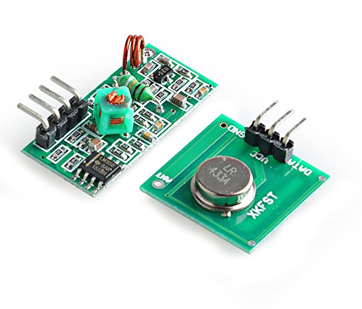
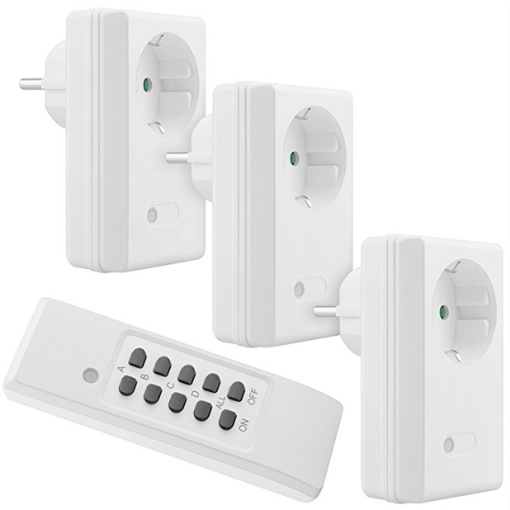
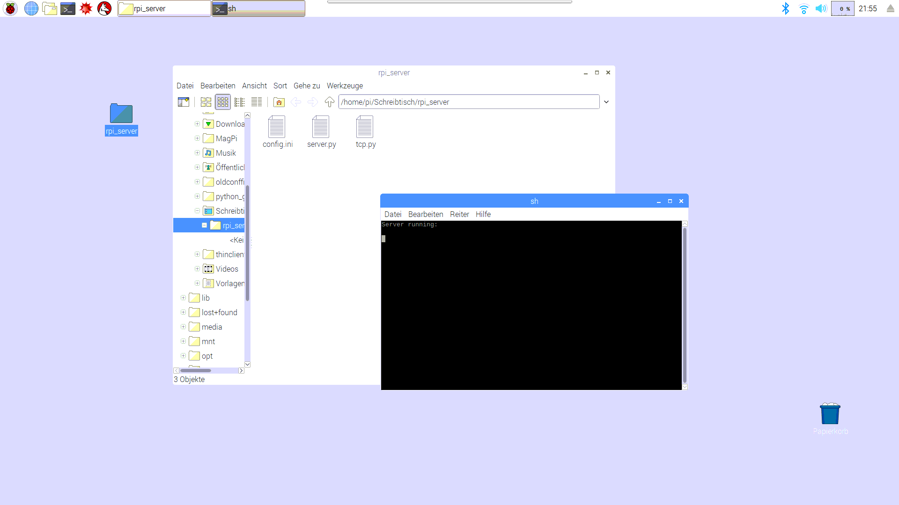
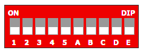
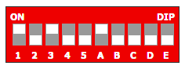

Rpi Home Automation
======

Introduction
------------

Rpi Home Automation is a complete setup to automate your home via Raspberry Pi 3 B/B+, a generic low-cost GPIO RF 433MHz module and generic RF 433 MHz outlets.

The current state is not usable yet, as it is still under development – so is the README not complete!

Supported hardware
------------

Most generic 433MHz capable modules connected via GPIO to a Raspberry Pi. (cost: ~2€)



Compatibility
------------

Generic 433MHz outlets. (cost: ~ 15€/3pcs)



Supported Chipsets:

-   SC5262 / SC5272
-   HX2262 / HX2272
-   PT2262 / PT2272
-   EV1527
-   RT1527
-   FP1527
-   HS1527

Installation (Incomplete)
------------

**Raspberry Pi 3:**

-   Install *Raspbian OS* on your Raspberry Pi 3
-   Connect your Raspberry Pi 3 with your home network via WLAN
-   Copy the folder *rpi\_server* to your Raspberry Pi 3.
-   Turn your Raspberry Pi 3 off and connect the 433MHz RF-Module with your Raspberry Pi 3 (See: Wiring diagram)
-   Turn your Raspberry Pi 3 on and run *rpi\_server.py*



**Remote outlets:**

Each remote outlet can be configured through dip switches. These have to be unique in order to identify them.



Each switch can have two states: *Up* and *Down*.

*Up* means *On* (1) and *Down* means *Off* (0)

The first five switches (1 - 5) represent the unique code and the switches A to E are the name.

Switches 1 to 5 can be set individually to set a unique code for this particular outlet. For the switches A to E can only one switch be set. Eg. if A is *On,* then B to C have to be *Off*.

So in the example below, dip switch 1 and 3 are *On* and switch A is also *On*.

Because A is *On*, B to E have to be *Off*.



As *On* means 1 and *Off* means 0, the above example would translate to:
```
-   10100 for the switches 1 to 5 and
-   10000 for switch A to E.
```
So the unique code for this outlet would be:
```
10100 10000
```

Wiring Diagram:
---------------
```
comming soon
```

Configure Android App
---------------------
```
comming soon
```